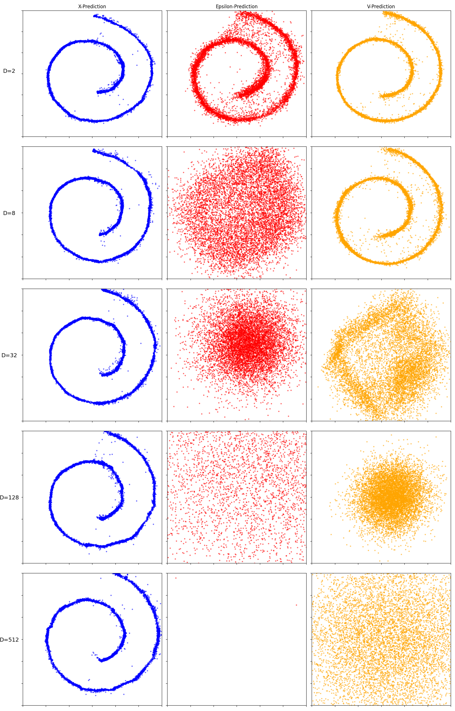
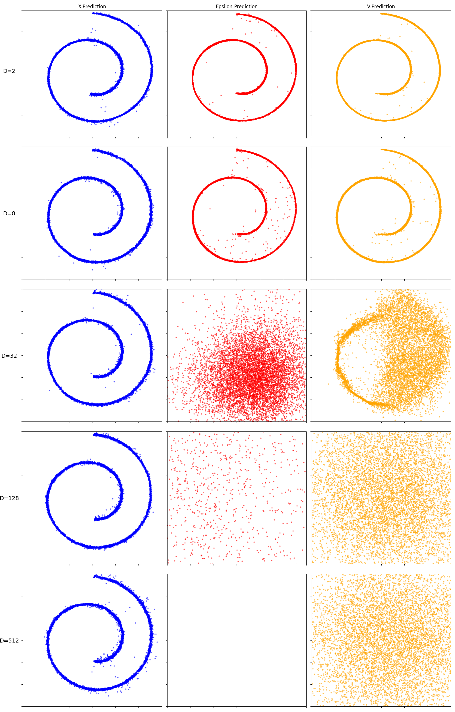

# JiT Toy Example

Unofficial implementation of the toy example in JiT https://arxiv.org/abs/2511.13720

## Overview

This repository implements a toy example demonstrating the JiT method for diffusion models. The example uses a Swiss roll dataset embedded in high-dimensional ambient spaces (D=2, 8, 32, 128, 512) to compare different prediction types (x-prediction, eps-prediction, v-prediction) with different loss types (v-loss, x-loss, eps-loss).

## Results

### X-Loss Results

### V-Loss Results

### Eps-Loss Results

## Usage

Run the Jupyter notebook `jit_toy_example.ipynb` to reproduce the results. The figures are generated using exactly the same hyper-parameters as specified in the notebook.
